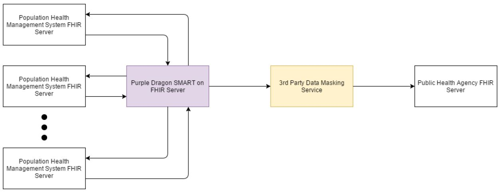
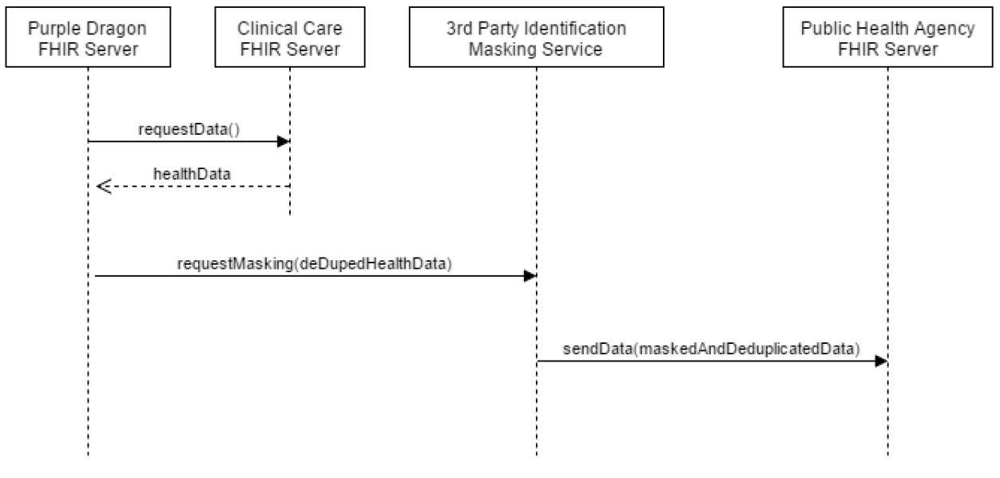
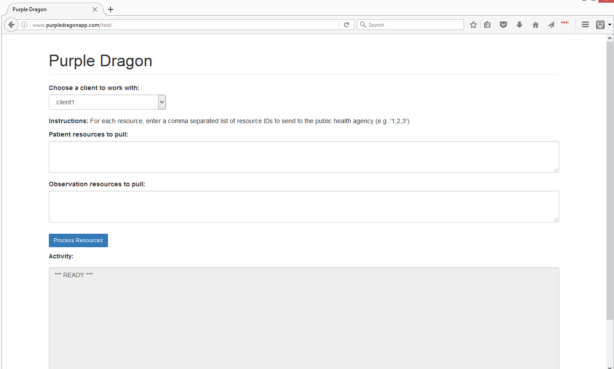
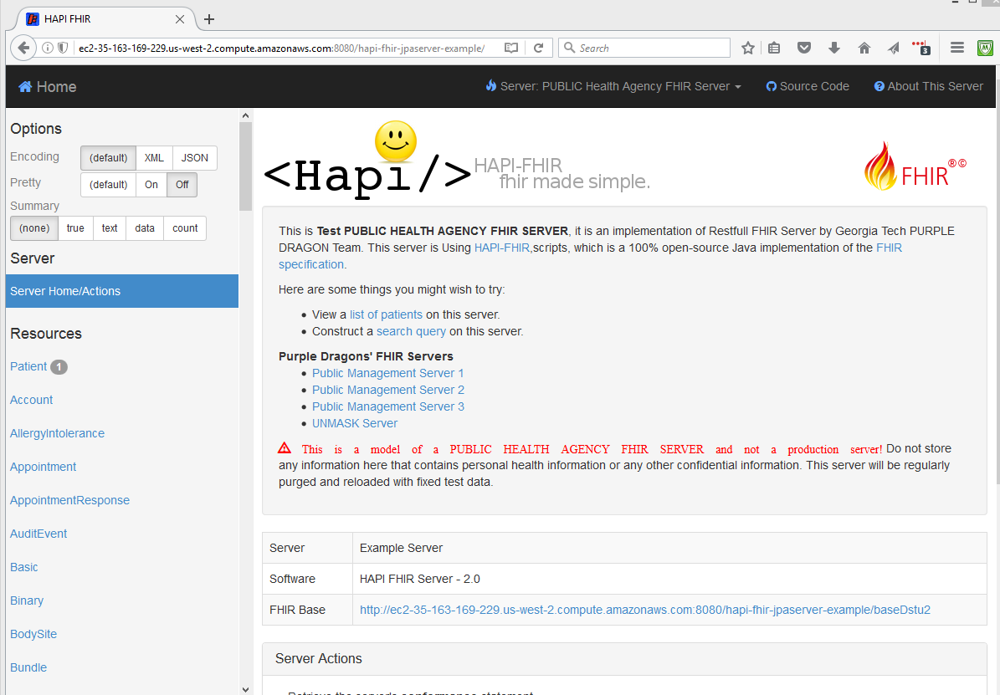
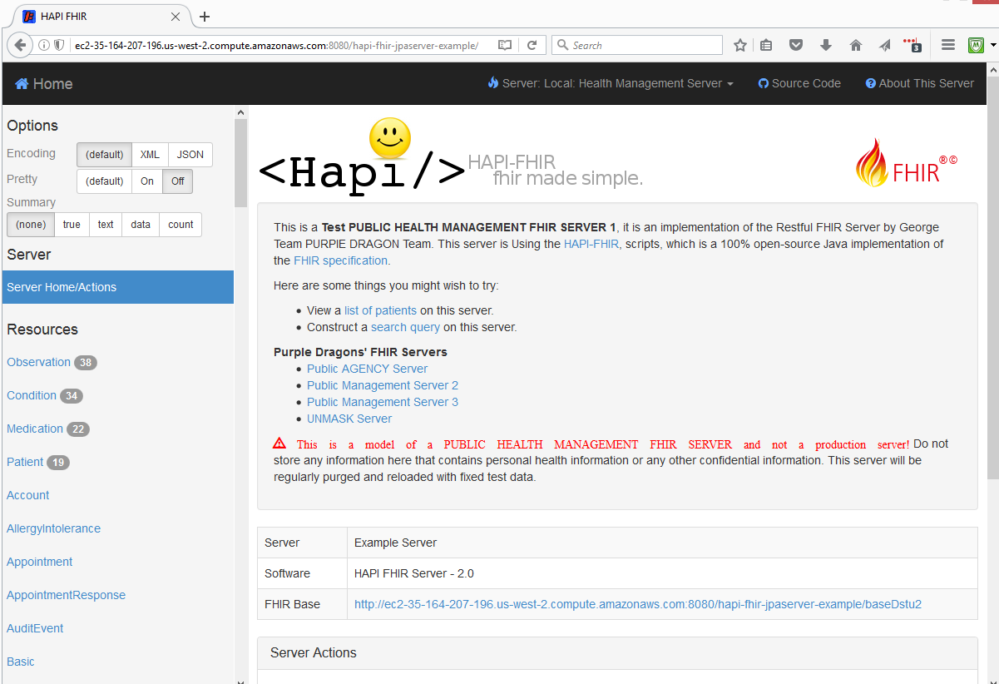
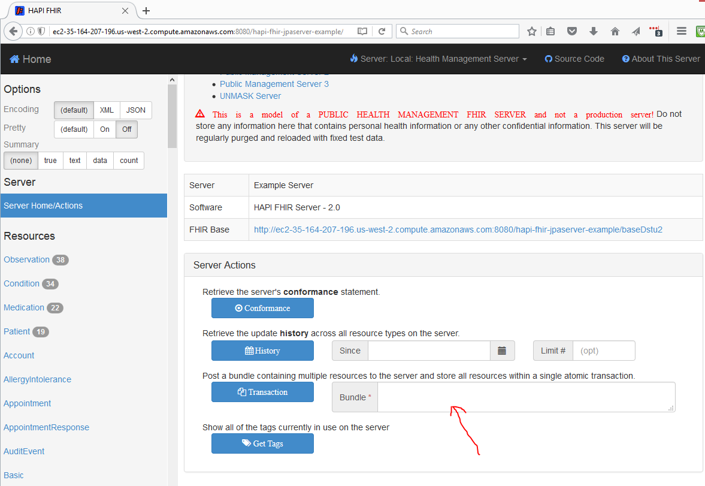
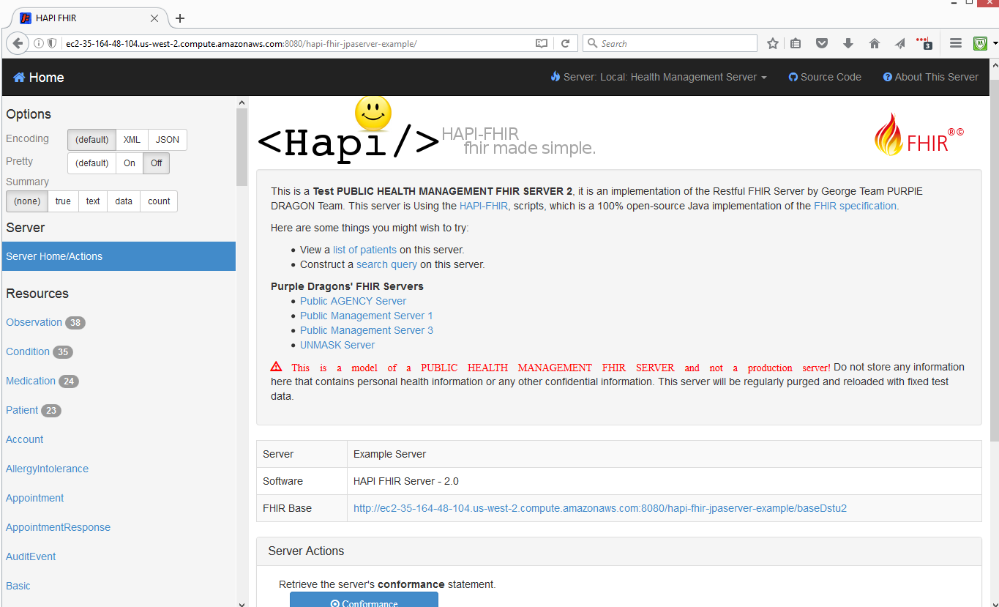
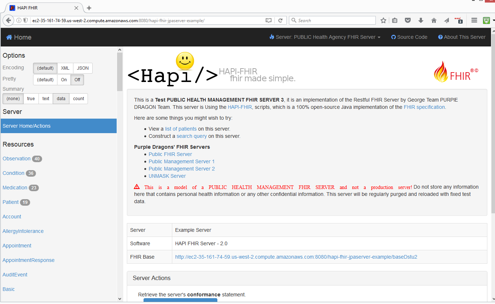

#                       Management Health Data For Public Health Use

#Table of Content
* [1.0 Introduction](#1.0-introduction)
	* [1.1 Topic](#1.1-topic)
	* [1.2 Team Name](#1.2-team-name)
	* [1.3 Team Members](#1.3-team-members)
	
* [2.0 Solution Architecture](#2.0-solution-archicture)
  * [2.1 Architecture Diagram](#2.1-architecture-diagram)
  * [2.2 System Workflow](#2.2-system-workflow)
  * [2.3 Sequence Diagram](#2.3-sequence-diagram)
  
* [3.0 Solution Implementation](#3.0-solution-implementation)
  * [3.1 FHIR App](#3.1-fhir-app)
  * [3.2 Agency FHIR Server](#3.2-agency-fhir-server)
  * [3.3 Management FHIR Server One](#3.3-management-fhir-server-one)
  * [3.4 Management FHIR Server Two](#3.4-management-fhir-server-two)
  * [3.5 Management FHIR Server Three](#3.5-management-fhir-server-three)
  * [3.6 FHIR Servers URL Links](#3.6-fhir-servers-url-links)

* [Catalog](#catalog)

## 1.0 Introduction
This project is a model implemented by Graduate students from Georgia Tech Institute of Technology.

### 1.1 Topic
The topic for this project is: CDC Population Health Informatics Framework: Population Health Management Data for Public Health Use.

### 1.2 Team Name
The team name is: Purple Dragons

### 1.3 Team Members
* Lucas Vollherbst
* Godswill Oletu
* Pingying Zeng

## 2.0 Solution Architecture
During research, many solutions were proposed, but we eventually settled for a solution, given the amount of resources availables and expected results.

Our solution comprises of six platform implementations, which includes the following components:
* Purple Dragon App
* Purple Dragon Agency FHIR Server
* Purple Dragon Management FHIR Server One
* Purple Dragon Management FHIR Server Two
* Purple Dragon Management FHIR Server Three
* Purple Dragon Masking FHIR Server.

Each of the above components are dictinct and separate server implementations. 
*	The Purple Dragon App & Masking FHIR Servers resides in the HIE (Health Information Exachanges). 
*	Each of the Purple Dragon Management FHIR servers modles independently owned and managed FHIR servers by clinics, hospitals, Doctors' office, etc.
*	The Purple Dragon FHIR server models the Public Health Agency server. This server collects all data from the various independently owned FHIR Management servers.
*	The Purple Dragon App can be implemented on a single server, but our model installed them on two different server platforms.

### 2.1 Architecture Diagram

The Architecture implemented is shown below:

  
*   Fig 2.1.1: Purple Dragon Architecture Diagram

### 2.2 System Workflow
The system workflow for the solution is described below:
*	Purple Dragon FHIR server requests relevant data from all applicable management FHIR servers (i.e. clinical care, hospitals, etc FHIR servers).
*	Purple Dragon FHIR server performs de-duplication on all received data.
*	Purple Dragon FHIR server performs masking service on the received data.
*	Purple Dragon FHIR serverthen stored the data in it's respository using the mask.

### 2.3 Sequence Diagram
The sequence diagram for the implemented solution is shown below:

  
*   Fig 2.1.1: Purple Dragon Sequence Diagram

## 3.0 Solution Implementation
The architecture of the implementation solution is made of many component parts as indicated in section 2.0 above.

The following components/servers were implemented:

* Purple Dragon App
* Purple Dragon Agency FHIR Server
* Purple Dragon Management FHIR Server One
* Purple Dragon Management FHIR Server Two
* Purple Dragon Management FHIR Server Three
* Purple Dragon Masking FHIR Server.

### 3.1 FHIR App
The FHIR App was hosted on Godaddy UNIX hosting platform utilizing port 80 for http access. Apart from the standard libraries provided by Godaddy, none other were implemented.

The URL for the FHIR App is:
http://wwww.purpledragonapp.com/test

The domain name Purpledragonapp.com was purchased from www.unicpage.com domain name services and redirected to our hosting platform at Godaddy.

The codes for the FHIR App can be found at:
 `Docs/codes/fhir-app/`
 
When implementing this solution, all the files/folders found in the above directory should be uploaded to the root directory of your web hosting platform. 

*	FHIR-App Screen shot:
  
*   Fig 3.1.1: Purple Dragon FHIR App Screen Shot

### 3.2 Agency FHIR Server
We utilized Amazon EC2 cloud services for the Agency FHIR server, the specifics of the server are:

* 	Ubuntu Server 16.04 LTS (HVM), SSD Volutme Type - ami-a9d276c9, 64-bits
* 	t2.micro
* 	Volume size: 8Gig

To implement the Agency FHIR Server:

*	Create an instance with the above information.
*	set admin password
	`sudo passwd`
    
*	Install at least Java 1.8
	`sudo apt update`
	`sudo apt-get install openjdk-8*`
    
*	Install maven
	`sudo apt install maven`
*	Copy the fold `hapi-fhir-jpaserver-example` from `Docs/codes/fhir-agency-server/` to your current ubuntu home directory `Use your favority FTP problem to copy this folder or configure samba in ubuntu for this`

*	Change directory to 'hapi-fhir-jpaserver-example'
	`cd hapi-fhir-jpaserver-example`
    
*	Use maven to compile the source code
	`mvn install`
    
*	Use 'screen', maven & Jetty to host the FHIR server for persistency
	`screen`  (press ENTER or SPACE BARD to Escape Screen)
    `mvn jetty:run`
    
*	The server takes a while to finish compilation and installation, from implementation, this took about three to five minutes.
*	If you are using Amazon, get your Amazon DNS name for this server and browse to e.g.
	`http://localhost:8080/hapi-fhir-jpaserver-example`
    
    Where 'localhost' is your server's Amazon DNS name or local IP address.
    
*	For our impelementation, our Agency server was reached at:
	`http://ec2-35-163-169-229.us-west-2.compute.amazonaws.com:8080/hapi-fhir-jpaserver-example/`
    
*	Agency Server Screen shot:
  
*   Fig 3.2.1: Purple Dragon Agency Server Screen Shot
	 
*	From the screen shot above, the links to 'Public Management Servers 1, 2, 3 and the UNMASK servers' will not work in your case. You have to edit the following file to change them:

	`cd ~/hapi-fhir-jpaserver-example/src/main/webapp/WEB-INF/templates/`     
    `nano tmpl-home-welcome.html`

*	In directory `/hapi-fhir-jpaserver-example`, we have renamed our project compiled codes as `project-target` for reference. When you run `mvn install` a new directory called `target` will be created for you.

## 3.3 Management FHIR server One

The implementation for Management FHIR One is similar to the FHRI Agency Server above.

However a few files were editted to give this server it's unique look and feel. To get this unique feel:

*	Repeats steps from section 3.2 above and stop after implmenting this step:
*	* 	Copy the fold `hapi-fhir-jpaserver-example` from `Docs/codes/fhir-agency-server/` to your current ubuntu home directory `Use your favority FTP problem to copy this folder or configure samba in ubuntu for this`

*	Goto `~/hapi-fhir-jpaserver-example/main/java/ca/uhn/fhir/jpa/demo` and rename the file `"Fhir TesterConfig.java"` to something else e.g. `"Fhir TesterConfig.java.OLD"`
*	Copy file:
	`Docs/codes/management-fhir-one/Fhir TesterConfig.java` 
    To:
    `~/hapi-fhir-jpaserver-example/main/java/ca/uhn/fhir/jpa/demo`
    
*	Goto `~/hapi-fhir-jpaserver-example/main/webapp/WEB-INF` and rename directory `templates` to e.g. `templates.OLD`
*	Copy directory:
	`Docs/codes/management-fhir-one/templates`
    To:
    `~/hapi-fhir-jpaserver-example/main/webapp/WEB-INF`

*	Change directory to 'hapi-fhir-jpaserver-example'
	`cd hapi-fhir-jpaserver-example`
    
*	Use maven to compile the source code
	`mvn install`
    
*	Use 'screen', maven & Jetty to host the FHIR server for persistency
	`screen`  (press ENTER or SPACE BARD to Escape Screen)
    `mvn jetty:run`
    
*	The server takes a while to finish compilation and installation, from implementation, this took about three to five minutes.
*	If you are using Amazon, get your Amazon DNS name for this server and browse to e.g.
	`http://localhost:8080/hapi-fhir-jpaserver-example`
    
    Where 'localhost' is your server's Amazon DNS name or local IP address.
    
*	For our impelementation, our Agency server was reached at:
	`http://ec2-35-164-207-196.us-west-2.compute.amazonaws.com:8080/hapi-fhir-jpaserver-example/`
    
*	Management Server One Screen shot:
  
  
*   Fig 3.3.1: Purple Dragon Management Server One Screen Shot
*   The mangement server will come with a default one patient resources.
*   To populate the server with resources, we wrote some bundle scripts in xml.
*   To populate the server with additional patient resources and some Condition, Medication and Observation resources:
*   * Goto `Docs/codes/fhir-resources/`
*   * Open the file call `patient data bundle.xml` with any text editor of your choice.
*   * Copy the contents of the file to clipboard and past them in the highlight section of the diagram below on your Management FHIR Server One.

*	Management FHIR Server Resource Screen shot:
  
*   Fig 3.2.1: Purple Dragon Management FHIR Server Resource Screen Shot
*	Then click on `Transaction` to post the data

## 3.4 Management FHIR server Two

Implementing Management server two and populating it with FHIR resources, is the same steps as illustrated in sections 3.2 and 3.3 above, except that:

*	The replacement files/directory contents for Management Server Two can be found at: `Docs/codes/management-fhir-two`
*	The URL of of our Management FHIR Two is:
	`http://ec2-35-164-48-104.us-west-2.compute.amazonaws.com:8080/hapi-fhir-jpaserver-example/`
*	The Screen shot of our Management FHIR Two is:
    
*	Management Server Two Screen shot:
  

## 3.5 Management FHIR server Three

Implementing Management server three and populating it with FHIR resources, is the same steps as illustrated in sections 3.2 and 3.3 above, except that:

*	The replacement files/directory contents for Management Server Two can be found at: `Docs/codes/management-fhir-three`
*	The URL of of our Management FHIR Two is:
	`http://ec2-35-161-74-59.us-west-2.compute.amazonaws.com:8080/hapi-fhir-jpaserver-example/`
*	The Screen shot of our Management FHIR Two is:
    
*	Management Server Three Screen shot:
  

## 3.6 FHIR Servers URL Links
As discussed above, we implemented Five FHIR servers and one FHIR Application. To access each of our modeled servers, click on any of the liks below.

Since, this is a model project, the servers might go offline any time.

*	<a href="http://www.purpledragonapp.com/test">`FHIR Application`</a>

*	<a href="http://ec2-35-163-169-229.us-west-2.compute.amazonaws.com:8080/hapi-fhir-jpaserver-example/">`PUBLIC Agency FHIR Server`</a>

*	<a href="http://ec2-35-164-207-196.us-west-2.compute.amazonaws.com:8080/hapi-fhir-jpaserver-example/">`PUBLIC Management FHIR Server One`</a>

*	<a href="http://ec2-35-164-48-104.us-west-2.compute.amazonaws.com:8080/hapi-fhir-jpaserver-example/">`PUBLIC Management FHIR Server Two`</a>

*	<a href="http://ec2-35-161-74-59.us-west-2.compute.amazonaws.com:8080/hapi-fhir-jpaserver-example/">`PUBLIC Management FHIR Server Three`</a>

*	<a href="http://ec2-35-162-112-117.us-west-2.compute.amazonaws.com:8080/hapi-fhir-jpaserver-example/">`MASKING Services FHIR Server`</a>

## Catalog
The catalog contain directory of all the modules and elements of our project and the catalog can be found at:

*	<a href="https://github.gatech.edu/gt-hit-fall2016/Population-Health-Management-Data/blob/master/Final%20Project/Final%20Application/catalog.pdf">`~\Final Project\Final Application\catalog.pdf`</a>
  

